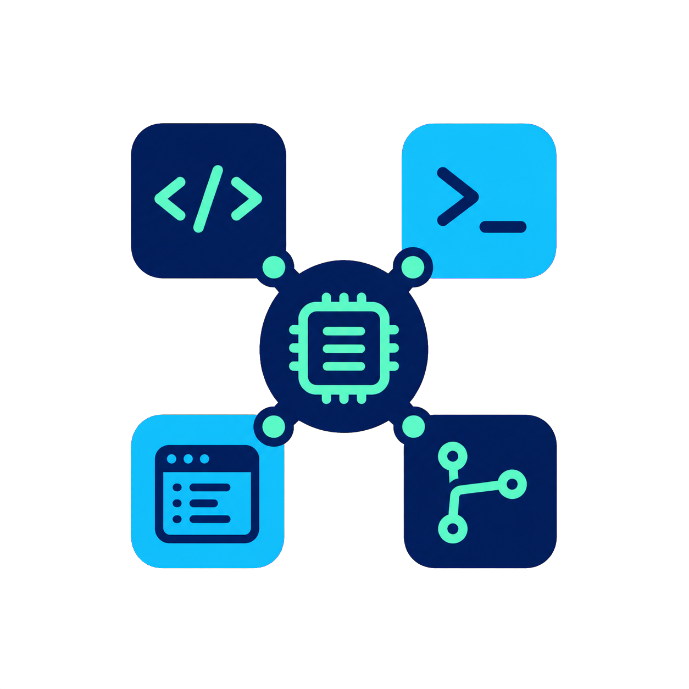

<p align="center">
  
</p>

<h1 align="center">CAMP</h1>

<p align="center">
  <strong>Cross-Agent Memory for Projects</strong><br>
  Shared project context for terminal, IDE, and desktop coding agents.
</p>

<p align="center">
  <a href="https://github.com/Sfeng666/CAMP/releases"></a>
  <a href="https://github.com/Sfeng666/CAMP/actions/workflows/ci.yml"></a>
  <a href="https://github.com/Sfeng666/CAMP/stargazers"></a>
  <a href="LICENSE"></a>
</p>

Switch coding agents without re-explaining the project. CAMP keeps a local,
project-scoped archive of matched conversations and turns durable work into a
short, provenance-backed handoff. It works across terminal agents such as
Codex CLI, Claude Code, Cursor Agent, and Antigravity CLI as well as their
desktop/IDE surfaces where those clients expose local history.

## Install

Requires Node.js 22.18 or newer. Install one package, then initialize any
repository or workspace:

```bash
npm install -g @camp-memory/cli
camp init /path/to/project
```

That is the entire CAMP installation. The CLI package includes the command,
MCP server, local archive, curated-memory store, daemon, agent adapters, and
bundled ChatCrystal/Memorix integrations. `camp init` detects installed agents,
merges only CAMP-owned configuration, starts the appropriate per-user service,
and begins a resumable history import.

Ollama is optional. CAMP automatically uses it when available for local
summaries and semantic search; without it, all history, handoffs, and lexical
search remain fully functional.

```bash
camp status /path/to/project --json
camp doctor --json
```

## What CAMP shares

1. **Capture** — lossless, content-addressed local conversations, tool events,
   and textual tool results are imported only when CAMP can confidently match
   them to a project.
2. **Curate** — decisions, constraints, progress, validation evidence, and
   unresolved work become compact handoffs with provenance and freshness state.
3. **Recall** — every configured agent receives at most 800 handoff tokens at
   session start and can retrieve task-specific history through MCP.

Current files, Git state, and the active user request always outrank memory.
CAMP does not mirror native chat threads into another app’s history UI.

## Supported agents

| Agent surface | CAMP integration | Verification status |
| --- | --- | --- |
| Codex CLI | MCP, hooks, incremental JSONL import | Live-validated on macOS; fixture-tested elsewhere |
| Claude Code | MCP, hooks, incremental JSONL import | Fixture/contract-tested |
| Cursor Agent CLI | MCP and exact-project transcript JSONL import | Fixture-tested |
| Cursor IDE | MCP and read-only VS Code database import | Live-validated on macOS |
| Antigravity CLI | MCP, CLI plugin, hook transcript bridge | Fixture/contract-tested |
| Antigravity desktop | MCP, plugin, read-only transcript bridge | Fixture/contract-tested |

`camp doctor` reports the actual coverage on the current machine. Unknown
storage schemas and parent-workspace conversations are quarantined instead of
being guessed or recalled automatically.

## Operating systems

| Host | CAMP service | Private storage |
| --- | --- | --- |
| macOS | launchd | `~/Library/Application Support/CAMP` |
| Linux | systemd user service | XDG config/data/state paths |
| Windows | Task Scheduler | `%APPDATA%\\CAMP` and `%LOCALAPPDATA%\\CAMP` |
| WSL | systemd user service or session daemon | Separate store inside each distro |

On minimal Linux or WSL installations without systemd, CAMP starts a locked
session daemon when its CLI or MCP server is invoked and clearly reports that
reduced persistence. Windows and WSL never share a live SQLite store.

## Commands

```text
camp init [path=. ] [--dry-run] [--portable] [--no-import]
camp sync [path=. ] [--once]
camp status [path=. ] [--json]
camp doctor [--json] [--repair]
camp review [path=. ]
camp search <query> [--project <path|id>] [--source raw|curated|all]
camp handoff [path=. ] [--task <text>]
camp remove [path=. ] [--purge]
camp upgrade --check|--apply
camp legacy-export --from-pima [--output <directory>]
```

Normal initialization does not edit the target project. Use `--portable` only
when you deliberately want `.camp/project.toml` committed or shared with a
project. `camp remove` retains private data by default; `--purge` requires an
exact-project confirmation.

If you are replacing a local PIMA prototype, first make an auditable backup:

```bash
camp legacy-export --from-pima
```

This uses SQLite's backup API for the live database, copies the matching local
archive/configuration, and writes hashes plus record counts to a manifest. It
never deletes legacy data.

## Why CAMP

| Project | Strength | CAMP’s distinct role |
| --- | --- | --- |
| [ChatCrystal](https://github.com/ZengLiangYi/ChatCrystal) | Imports and searches coding conversations. | CAMP makes one project identity authoritative, keeps a canonical archive, and safely bridges CLI/large Cursor sources. |
| [Memorix](https://github.com/AVIDS2/memorix) | Git-aware curated coding memory. | CAMP adds raw-history retention, non-Git projects, provenance, quarantine, and bounded handoffs. |
| [AgentMemory](https://github.com/rohitg00/agentmemory) | Broad agent capture and hybrid memory. | CAMP prioritizes strict project isolation, read-only native-store access, and a single self-contained install. |
| [Basic Memory](https://github.com/basicmachines-co/basic-memory) | Durable Markdown knowledge shared through MCP. | CAMP keeps exact transcript evidence separate from curated engineering context and tracks Git/file staleness. |

This is a feature-scope comparison based on public documentation, not a
performance claim. CAMP’s unique advantage is one stable project identity
across terminal and IDE agents, combining searchable raw evidence with small,
provenance-backed handoffs without writing to native agent databases.

## Privacy and safety

- Private data stays local and is created with owner-only permissions where the
  host supports POSIX modes.
- CAMP exposes only stdio or loopback services. Runtime transcript processing
  makes no cloud requests.
- Credentials, tokens, environment values, and user-facing outreach content
  are never promoted into automatic curated memory.
- A moved directory, clone, worktree, or non-Git workspace keeps a stable
  project identity through filesystem and Git aliases.

## Built with and cited sources

CAMP bundles [ChatCrystal](https://github.com/ZengLiangYi/ChatCrystal) for
raw-history indexing, [Memorix](https://github.com/AVIDS2/memorix) for
Git-aware curated memory, [Ollama](https://github.com/ollama/ollama) for
optional local models, and the [Model Context Protocol TypeScript
SDK](https://github.com/modelcontextprotocol/typescript-sdk). Agent adapters
follow the official [Codex CLI](https://developers.openai.com/codex/cli/),
[Claude Code](https://docs.anthropic.com/en/docs/claude-code/getting-started),
[Cursor CLI](https://docs.cursor.com/en/cli/installation), and
[Antigravity CLI](https://antigravity.google/docs/cli-overview) documentation.

Pinned versions, licenses, and modification notices are in
[THIRD_PARTY_NOTICES.md](./THIRD_PARTY_NOTICES.md).

## License

CAMP is licensed under the [GNU Affero General Public License v3.0](https://github.com/Pickle-Pixel/ApplyPilot/blob/main/LICENSE) or later. See [LICENSE](./LICENSE).

For the data contracts, migration safety rules, and acceptance criteria, see
[IMPLEMENTATION_PLAN.md](./IMPLEMENTATION_PLAN.md).
