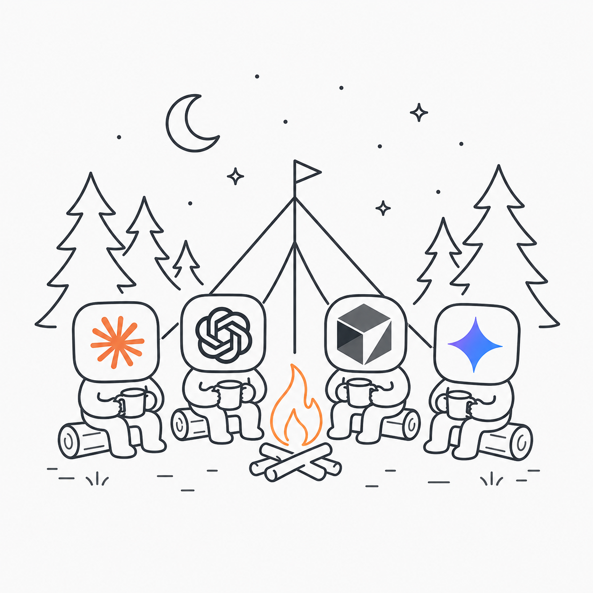

<p align="center">
  <picture>
    <source media="(prefers-color-scheme: dark)" srcset="assets/logo_dark.png">
    <source media="(prefers-color-scheme: light)" srcset="assets/logo_light.png">
    
  </picture>
</p>

<h1 align="center">CAMP</h1>

<p align="center">
  <strong>Cross-Agent Memory for Projects</strong><br>
  Shared project context for different coding agents.
</p>

<p align="center">
  <a href="https://github.com/Sfeng666/CAMP/releases"></a>
  <a href="https://github.com/Sfeng666/CAMP/actions/workflows/ci.yml"></a>
  <a href="https://github.com/Sfeng666/CAMP/stargazers"></a>
  <a href="LICENSE"></a>
</p>

Switch coding agents without re-explaining the project. CAMP keeps a local,
project-scoped archive of matched conversations and turns durable work into a
short, provenance-backed handoff. It works across terminal agents such as
Codex CLI, Claude Code, Cursor Agent, and Antigravity CLI as well as their
desktop/IDE surfaces where those clients expose local history.

## Install

Requires Node.js 22.18 or newer. Install one package, then initialize any
repository or workspace:

```bash
npm install -g @camp-memory/cli
camp init /path/to/project
```

If npm reports `EACCES` while creating `/usr/local/bin/camp`, use a
user-owned prefix instead of `sudo`:

```bash
export PATH="$HOME/.local/bin:$PATH"
npm install --global --prefix "$HOME/.local" @camp-memory/cli
camp init /path/to/project
```

This keeps the installation inside your home directory and works on macOS and
Linux without changing system-owned directories.

That is the entire CAMP installation. The CLI package includes the command,
MCP server, local archive, curated-memory store, daemon, agent adapters, and
narrow ChatCrystal- and Memorix-compatible storage adapters. It does not install
either upstream project's web server, model runtime, watchers, or optional
image dependencies. `camp init` detects installed agents, merges only
CAMP-owned configuration, starts the appropriate per-user service, and begins
a resumable history import.

To make context verification automatic, initialization approves exactly three
CAMP tools where the client supports per-tool rules:

```text
camp_context_for_task
camp_ack_context
camp_start_verification
```

These approvals cannot run a shell, edit project files, search other projects,
or write ordinary curated memory. All other CAMP tools keep the client's normal
approval behavior. Antigravity desktop may show a one-time prompt because its
per-tool policy is stored by the app; approve only the exact tool shown above.
`camp remove` removes unchanged CAMP-owned rules while preserving user edits.

Ollama is optional. CAMP automatically uses it when available for local
summaries and semantic search; without it, all history, handoffs, and lexical
search remain fully functional.

```bash
camp status /path/to/project --json
camp doctor --json
```

`camp status` checks storage and synchronization. It does not prove that the
current agent received the context; use the receipt handshake below for that.

## What CAMP shares

1. **Capture:** lossless, content-addressed local conversations, tool events,
   and textual tool results are imported only when CAMP can confidently match
   them to a project.
2. **Curate:** decisions, constraints, progress, validation evidence, and
   unresolved work become compact handoffs with provenance and freshness state.
3. **Recall:** every configured agent receives at most 800 handoff tokens at
   session start and can retrieve task-specific history through MCP.

Current files, Git state, and the active user request always outrank memory.
CAMP does not mirror native chat threads into another app’s history UI.

## Verify context in any agent

Paste this once at the start of a coding-agent session:

```text
Before doing work, call camp_context_for_task for this task. Then call
camp_ack_context on the same MCP connection. Copy structuredContent.receipt.id,
structuredContent.receipt.challenge, and the complete
structuredContent.receipt.evidenceIds array exactly, with no additions or
substitutions, and include one recalled fact. Report the project ID, current
commit, worktree fingerprint, handoff hash, per-source freshness, and
acknowledgment verdict. Do not claim CAMP context is verified unless both tools
succeed and the acknowledgment is PASS.
```

The receipt is signed and bound to the current project, commit, worktree,
handoff, returned evidence, successful source scans, and MCP client instance.
It expires after five minutes. Acknowledgment proves that the current agent
received that exact context and identified its evidence; no tool can prove a
model’s private reasoning.

- `PASS`: fresh, correctly scoped context was received and acknowledged.
- `WARN`: context was acknowledged, but an optional backend is degraded.
- `FAIL`: context is stale, mismatched, expired, incomplete, or unacknowledged.

Inspect a receipt independently:

```bash
camp context-status --receipt <receipt-id> --json
```

For an end-to-end agent switch, ask the source agent to call
`camp_start_verification`, echo its unpredictable canary, and give you the run
ID. In the target agent, call `camp_context_for_task` with that
`verification_run_id`, then acknowledge it. CAMP requires both the imported raw
source transcript and isolated curated canary evidence:

```bash
camp verify status <run-id> --json
```

## Supported agents

| Agent surface | CAMP integration | Verification status |
| --- | --- | --- |
| Codex CLI | MCP, hooks, incremental JSONL import | Live-verified on macOS in 0.1.8 as the receiving agent for a Cursor Agent CLI canary |
| Claude Code | MCP, hooks, incremental JSONL import | Configured on the test Mac; awaiting supported credentials |
| Cursor Agent CLI | MCP and exact-project transcript JSONL import | Live-verified on macOS in 0.1.8 as the source agent for a Codex CLI canary receipt |
| Cursor IDE | MCP and read-only VS Code database import | Contract-tested; desktop receipt test still pending |
| Antigravity CLI | MCP, CLI plugin, hook transcript bridge | Contract-tested; live test blocked by the local Antigravity quota on 2026-08-12 |
| Antigravity desktop | MCP, plugin, read-only transcript bridge | Receipt/canary contract-tested; desktop receipt test still pending |

`camp doctor` reports the actual coverage on the current machine. Unknown
storage schemas and parent-workspace conversations are quarantined instead of
being guessed or recalled automatically.

## Operating systems

| Host | CAMP service | Private storage |
| --- | --- | --- |
| macOS | launchd | `~/Library/Application Support/CAMP` |
| Linux | systemd user service | XDG config/data/state paths |
| Windows | Task Scheduler | `%APPDATA%\\CAMP` and `%LOCALAPPDATA%\\CAMP` |
| WSL | systemd user service or session daemon | Separate store inside each distro |

On minimal Linux or WSL installations without systemd, CAMP starts a locked
session daemon when its CLI or MCP server is invoked and clearly reports that
reduced persistence. Windows and WSL never share a live SQLite store.

## Commands

```text
camp init [path=. ] [--dry-run] [--portable] [--no-import]
camp sync [path=. ] [--once]
camp status [path=. ] [--json]
camp doctor [--json] [--repair]
camp review [path=. ]
camp search <query> [--project <path|id>] [--source raw|curated|all]
camp handoff [path=. ] [--task <text>]
camp context-status --receipt <id> [--json]
camp verify status <run-id> [--json]
camp verify cancel <run-id>
camp remove [path=. ] [--purge]
camp upgrade --check|--apply
camp legacy-export --from-pima [--output <directory>]
```

Normal initialization does not edit the target project. Use `--portable` only
when you deliberately want `.camp/project.toml` committed or shared with a
project. `camp remove` retains private data by default; `--purge` requires an
exact-project confirmation.

If you are replacing a local PIMA prototype, first make an auditable backup:

```bash
camp legacy-export --from-pima
```

This uses SQLite's backup API for the live database, copies the matching local
archive/configuration, and writes hashes plus record counts to a manifest. It
never deletes legacy data.

## Why CAMP

Capability benchmark, checked against each project's linked public
documentation on 2026-08-09:

| Project | Raw coding transcripts | Curated project/Git memory | Non-Git workspace | Signed delivery receipt |
| --- | --- | --- | --- | --- |
| **CAMP** | Exact matched sessions, tools, and text outputs | Provenance, lifecycle, fingerprints, and handoffs | Yes | Yes, with same-client acknowledgment |
| [Engram](https://github.com/semantic-craft/engram) | Automatic prompt, tool, and session capture; recall centers on a compiled wiki | Git-versioned Markdown wiki and handoffs | Yes | Not documented |
| [ChatCrystal](https://github.com/ZengLiangYi/ChatCrystal) | Its primary strength | Distilled notes | Yes | Not documented |
| [Memorix](https://github.com/AVIDS2/memorix) | Hook/session capture where hosts expose it | Its primary strength; project identity requires Git | No | Not documented |
| [AgentMemory](https://github.com/rohitg00/agentmemory) | Broad hook capture and session history | Hybrid memory and Git snapshots | Documented as server-scoped | Not documented |
| [Basic Memory](https://github.com/basicmachines-co/basic-memory) | Selected conversation imports | Human-readable Markdown knowledge graph | Yes | Not documented |

“Not documented” means the linked project documentation did not claim that
capability; it does not mean the project can never add it. This is a
feature-scope comparison, not a competitor performance claim.

CAMP’s unique advantage is the combination of an exact, searchable evidence
archive and a cryptographically signed delivery receipt that binds returned
context to source freshness, current Git/worktree state, evidence IDs, and the
same MCP client acknowledgment. Its compact handoffs remain provenance-backed,
native agent databases remain read-only, ambiguous sessions remain
quarantined, and one install configures all supported agents.

On macOS, the local 0.1.8 packed artifact passed a live Cursor Agent CLI to
Codex CLI canary test on 2026-08-12. CAMP imported one fresh Cursor session,
bound its raw transcript to a project-scoped canary, and accepted Codex's
same-client acknowledgment with `PASS`. The suite also exercises a sparse 6 GB
Cursor database under a 750 MB RSS gate. These are reproducible release gates,
not cross-project speed claims.

## Privacy and safety

- Private data stays local and is created with owner-only permissions where the
  host supports POSIX modes.
- One daemon owns the only writable SQLite handle. CLI, MCP, hooks, and
  importers use an authenticated private Unix socket, Windows named pipe, or a
  constrained-environment local fallback; runtime transcript processing makes
  no cloud requests.
- Credentials, tokens, environment values, and user-facing outreach content
  are never promoted into automatic curated memory.
- A moved directory, clone, worktree, or non-Git workspace keeps a stable
  project identity through filesystem and Git aliases.

## Built with and cited sources

CAMP uses narrow, local adapters compatible with
[ChatCrystal](https://github.com/ZengLiangYi/ChatCrystal) 0.5.8 for raw-history
indexing and [Memorix](https://github.com/AVIDS2/memorix) 1.3.1 for Git-aware
curated memory. CAMP installs neither upstream server/runtime. It uses
[Ollama](https://github.com/ollama/ollama) for
optional local models. Its minimal stdio MCP runtime is contract-tested with
the [Model Context Protocol TypeScript
SDK](https://github.com/modelcontextprotocol/typescript-sdk), which is not
installed for end users. Agent adapters
follow the official [Codex CLI](https://developers.openai.com/codex/cli/),
[Claude Code](https://code.claude.com/docs/en/getting-started),
[Cursor CLI](https://docs.cursor.com/en/cli/installation), and
[Antigravity CLI](https://antigravity.google/docs/cli-overview) documentation.

Pinned versions, licenses, and modification notices are in
[THIRD_PARTY_NOTICES.md](./THIRD_PARTY_NOTICES.md).

## License

CAMP is licensed under the [GNU Affero General Public License v3.0](https://github.com/Pickle-Pixel/ApplyPilot/blob/main/LICENSE) or later. See [LICENSE](./LICENSE).

For the data contracts, migration safety rules, and acceptance criteria, see
[IMPLEMENTATION_PLAN.md](./IMPLEMENTATION_PLAN.md).
